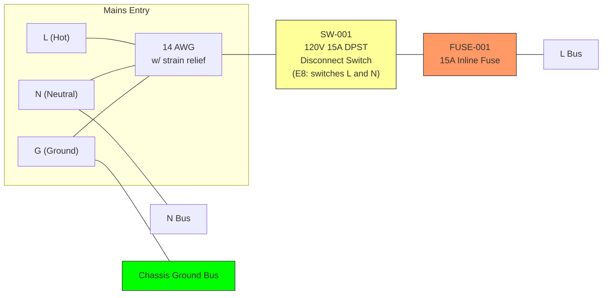
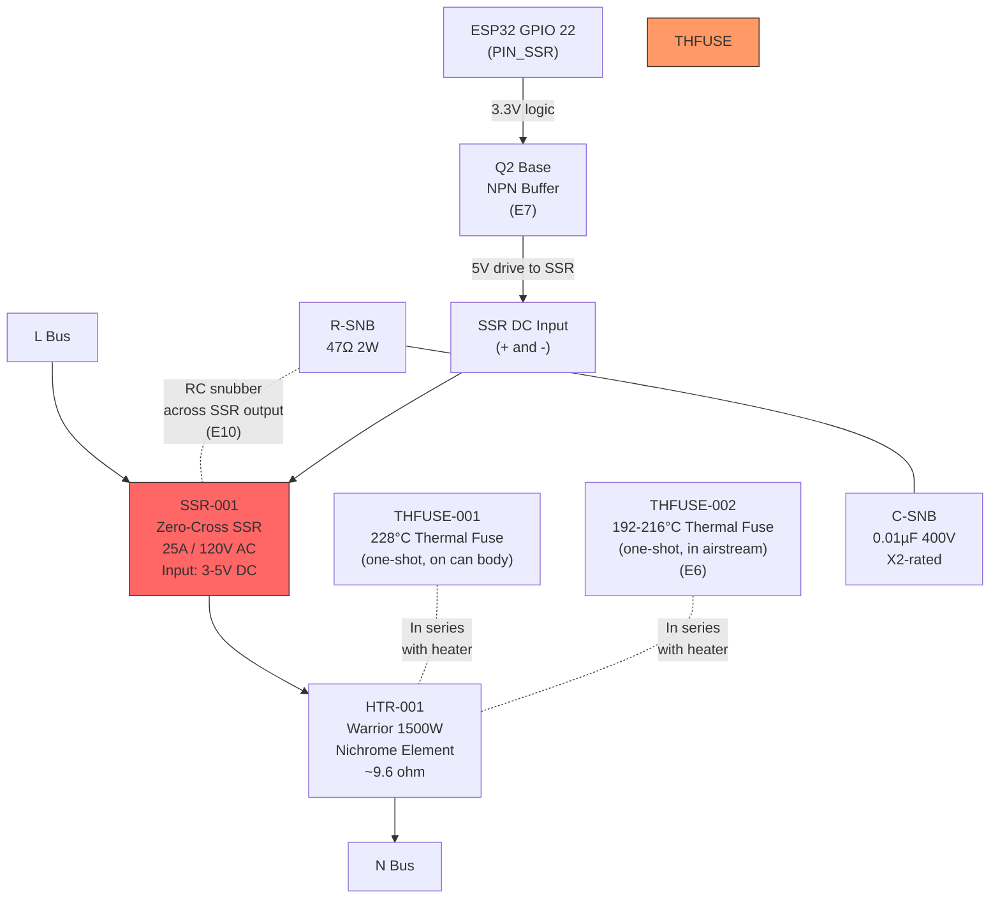
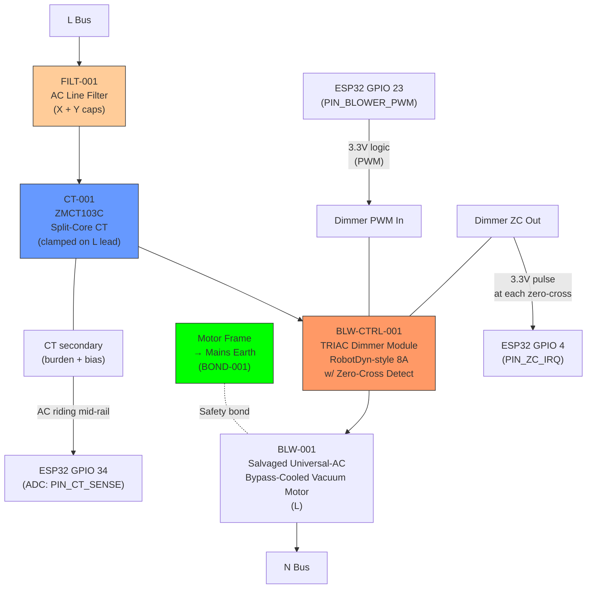
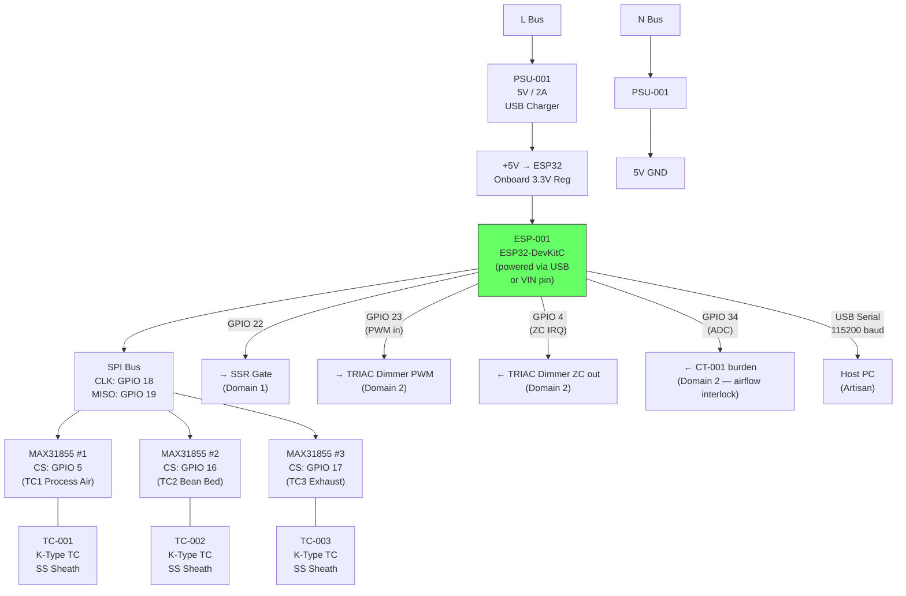
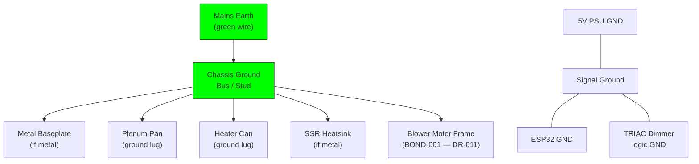

# Power Circuit Schematic

## Mains Entry and Protection

## Domain 1: 120V AC Heater Circuit

### Heater Circuit Notes

- SSR switches L (hot) side only — N is continuous to element
- **Two thermal fuses in series (E6):**
  - THFUSE-001 (228°C): mounted on heater can body — detects can overheat
  - THFUSE-002 (192–216°C): mounted in the heated airstream downstream of element —
    detects no-airflow overheat faster (lower thermal lag than can body)
- Thermal fuses are independent backups — if SSR fails shorted and safety firmware
  fails, the thermal fuses are the last-resort cutoff
- **SSR drive buffer (E7):** ESP32 GPIO 22 drives an NPN transistor (2N2222 or similar)
  that switches a 5V signal to the SSR DC input. Many commodity SSRs need >3.5V to
  reliably trigger — 3.3V from ESP32 is marginal. The NPN buffer provides a clean
  5V drive with negligible added cost.
- **RC snubber (E10):** 47Ω + 0.01µF/400V X2-rated capacitor across SSR output terminals.
  Suppresses voltage spikes from inductive heater element switching, protects SSR.
- Zero-cross switching for burst-fire duty cycle control (1s period, HEATER_PERIOD_MS)
- **Heater draws ~12.5A at 120V** (P = V²/R = 14400/9.6 ≈ 1500W)
- **E5 — Fusing concern:** 12.5A continuous on a 15A fuse / 15A circuit is 83% of
  rating. NEC requires ≤80% for continuous loads. Options:
  1. Use a 20A circuit (12 AWG cord) — preferred if available
  2. Limit heater duty to stay under 12A continuous average
  3. Accept that v1 bench testing will likely not run 3+ hours continuously

## Domain 2: 120V AC Blower Circuit (DR-011 — supersedes DR-003)

### Blower Circuit Notes

- **BLW-001 (salvaged bypass-cooled vacuum motor):** Universal AC motor, ~1–4 A
  draw at 120 V depending on size. Bypass-cooled (two-stage) is required —
  flow-through motors shed brush carbon into the bean airstream. Frame is bonded
  to mains earth via BOND-001 (universal motors have nontrivial leakage current).
- **BLW-CTRL-001 (TRIAC dimmer module):** RobotDyn-class 8 A AC dimmer with
  on-board zero-cross detector. Two logic-level pins: PWM in (gate trigger), ZC
  out (pulse at each AC zero-cross). ESP32 phase-fires the TRIAC at a delay
  set by the commanded duty.
- **CT-001 (ZMCT103C 5 A split-core CT):** Clamped on one motor lead. Secondary
  output biased to ADC mid-rail with a burden resistor + DC offset divider; ESP32
  samples the AC waveform on GPIO 34 and computes RMS for the airflow interlock.
  Replaces the implicit `blower_is_running() = (PWM > 0)` check from DR-003.
- **FILT-001 (AC line filter):** X-cap line-to-neutral, Y-caps line/neutral-to-earth.
  Suppresses TRIAC-induced conducted EMI from re-entering the mains and the rest
  of the system. Mandatory for SPI signal integrity in this topology.
- **Ferrite chokes (FERR-001):** Snap-on cores on the motor leads (between TRIAC
  and motor) and on every TC SPI cable. Brushed motor + TRIAC switching is a
  significant EMI source — E13 shielded SPI cable is necessary but not sufficient.
- **PWM frequency:** Phase-angle control synchronized to mains zero-cross — not
  high-frequency PWM. The "PWM" pin on the dimmer module is really a gate trigger
  whose timing within each half-cycle determines conduction angle.
- **Speed range:** 0%–100% conduction angle maps to 0%–100% motor speed.
  Practical operating range will be the upper portion (e.g., 30%–80% conduction
  angle) — universal motors don't run smoothly at very low conduction.
- **DR-011:** Replaces DR-003 (12V DC brushless blower with MOSFET PWM).
  Resolves T1 (P-Q gap on the previous blower).

## Domain 3: 3.3V DC Control Circuit

### Control Circuit Notes

- ESP32 powered via USB (5V) — onboard regulator provides 3.3V for MCU and GPIO
- Three MAX31855 share SPI bus (CLK, MISO) with individual CS lines
- MOSI not connected — MAX31855 is read-only
- SPI clock: default ~4 MHz (MAX31855 max is 5 MHz)
- USB serial provides both power and data connection to host PC
- **All signal wiring (22-26 AWG) must be physically routed away from mains wiring (14 AWG)**

## Grounding

### Grounding Notes

- **Chassis ground (earth):** All metal enclosure parts bonded to mains earth via
  dedicated ground wire. This is safety-critical — prevents shock if a mains wire
  contacts the chassis. **DR-011: vacuum motor frame must be earth-bonded** via
  BOND-001 — universal motors have nontrivial leakage current.
- **Signal ground:** 5V PSU GND, ESP32 GND, and TRIAC dimmer logic GND share a
  common return (star ground at the 5V PSU output).
- **Do NOT connect chassis earth to signal ground** unless through the PSU's
  internal earth-ground bond (most isolated switching PSUs bond earth to output
  GND via a high-value resistor or Y-cap internally).
- **CT-001 secondary** is referenced to signal ground via its bias network —
  the primary (motor lead) is mains-isolated by the magnetic coupling of the CT.

## Complete Pin Assignment Summary

| ESP32 GPIO | Function | Connected To | Wire Gauge |
|------------|----------|-------------|------------|
| 18 | SPI CLK | MAX31855 x3 CLK | 22-26 AWG |
| 19 | SPI MISO | MAX31855 x3 DO | 22-26 AWG |
| 5 | TC1 CS | MAX31855 #1 CS | 22-26 AWG |
| 16 | TC2 CS | MAX31855 #2 CS | 22-26 AWG |
| 17 | TC3 CS | MAX31855 #3 CS | 22-26 AWG |
| 22 | SSR Control | SSR-001 DC input (+) | 22-26 AWG |
| 23 | Blower TRIAC PWM (gate trigger) | BLW-CTRL-001 PWM in | 22-26 AWG |
| 4 | Zero-cross interrupt input | BLW-CTRL-001 ZC out | 22-26 AWG |
| 34 | ADC: CT current sense (airflow interlock) | CT-001 burden / bias network | 22-26 AWG shielded |
| USB | Serial data | Host PC (Artisan) | USB cable |

## Bill of Electrical Materials (schematic-specific)

| Ref | Component | Value | Package | Notes |
|-----|-----------|-------|---------|-------|
| BLW-CTRL-001 | TRIAC dimmer module | 8A AC, ZC detect | RobotDyn-style PCB | Phase-angle blower control (DR-011) |
| CT-001 | Current transformer | ZMCT103C 5A | Split-core, PCB-mount | Airflow interlock — RMS sensed on GPIO 34 (DR-011) |
| FILT-001 | AC line filter | X+Y cap module | Inline | Conducted-EMI suppression on motor leads (DR-011) |
| FERR-001 | Snap-on ferrite cores | Mixed dia. (4–10 mm cable) | Clamp-on | Motor leads + TC SPI cables (DR-011) |
| BOND-001 | Earth bond lug + ring terminal | M4 or #8 | Hardware | Motor frame → mains earth (DR-011) |
| Q2 | NPN transistor | 2N2222 or similar | TO-92 | SSR drive buffer (E7) — 5V to SSR |
| R3 | SSR buffer base resistor | 1k ohm | 1/4W axial | Limits base current for Q2 (E7) |
| R-SNB | Snubber resistor | 47 ohm | 2W | Across SSR output (E10) |
| C-SNB | Snubber capacitor | 0.01 µF / 400V | X2-rated film | Across SSR output (E10) |
| THFUSE-002 | Thermal fuse (airstream) | 192–216°C | Axial | In-airstream backup (E6) |

**Removed by DR-011:** Q1 (IRLZ44N MOSFET), R1 (100 Ω gate), R2 (10 kΩ pulldown),
D1 (SS34 flyback). All were 12 V DC blower drive parts; not needed with the
TRIAC-controlled AC motor.
