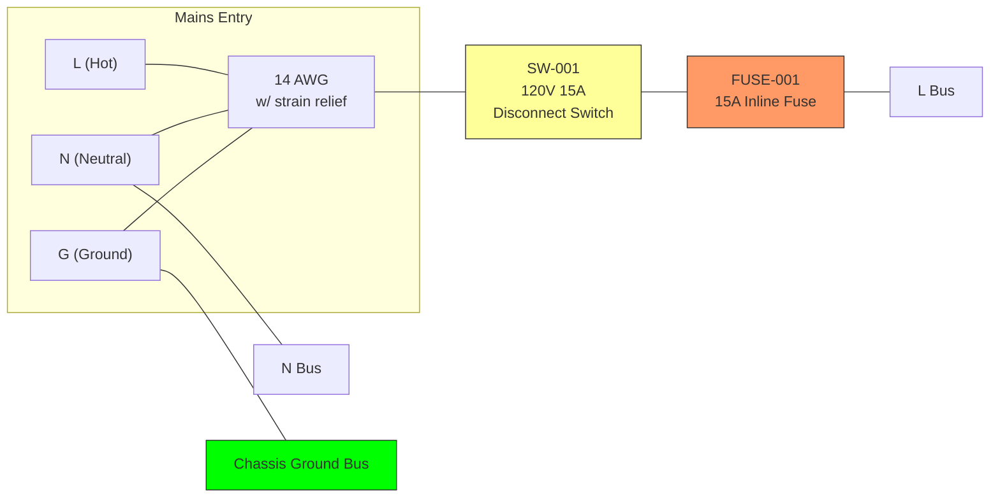
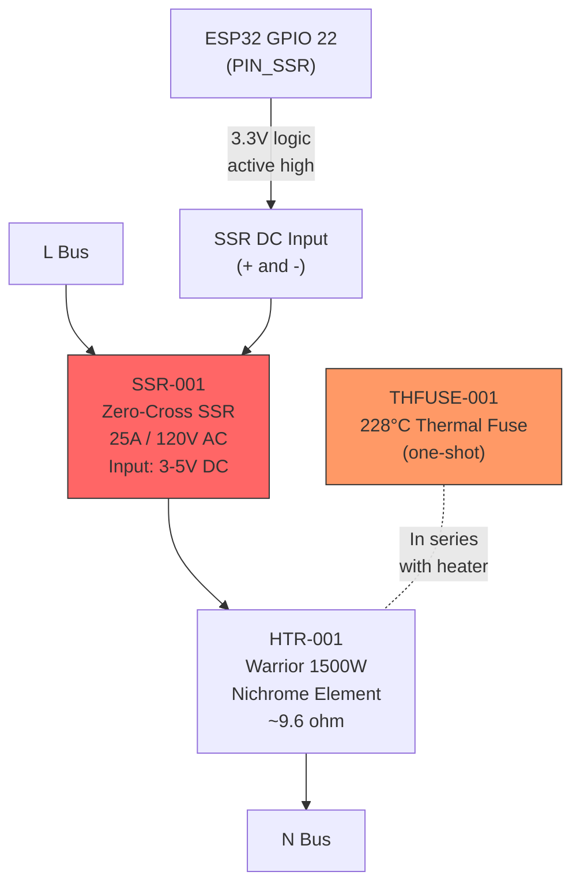
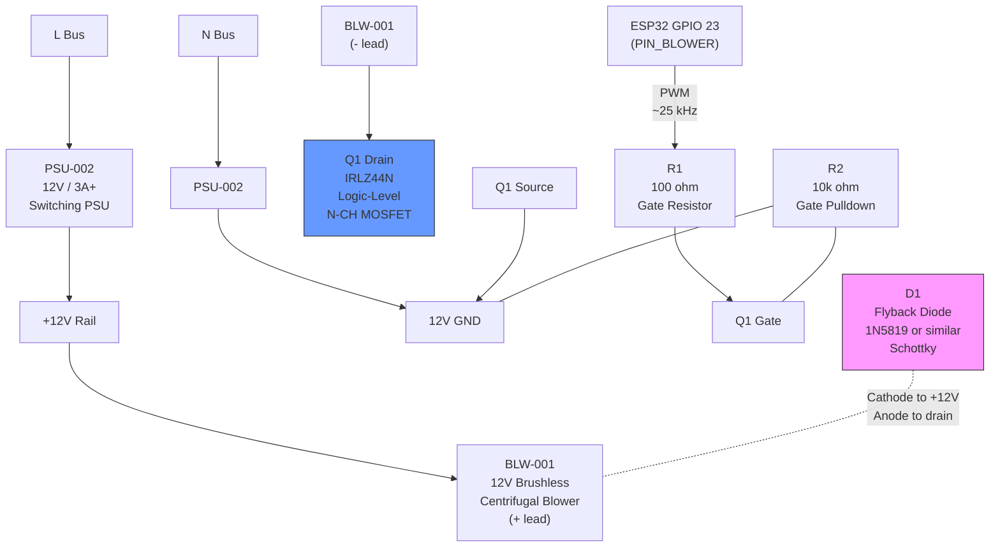
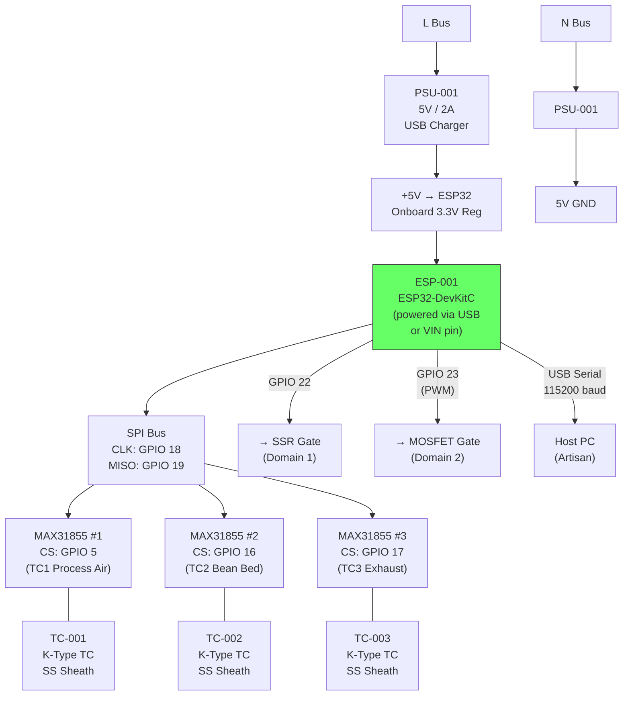
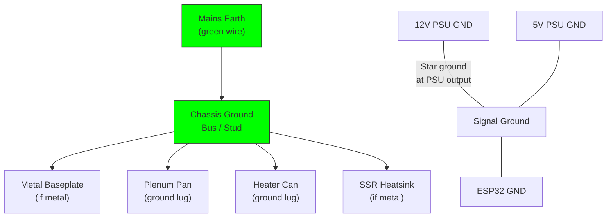

# Power Circuit Schematic

## Mains Entry and Protection

## Domain 1: 120V AC Heater Circuit

### Heater Circuit Notes

- SSR switches L (hot) side only — N is continuous to element
- Thermal fuse (THFUSE-001) in series with heater element, mounted on heater can body
- Thermal fuse is independent backup — if SSR fails shorted and safety firmware fails,
  the thermal fuse is the last-resort cutoff
- SSR control: ESP32 GPIO 22 drives SSR DC input (3.3V sufficient for most SSRs)
- Zero-cross switching for burst-fire duty cycle control (1s period, HEATER_PERIOD_MS)
- **Heater draws ~12.5A at 120V** (P = V²/R = 14400/9.6 ≈ 1500W)

## Domain 2: 12V DC Blower Circuit

### Blower Circuit Notes

- **Q1 (IRLZ44N):** Logic-level N-channel MOSFET. Vgs(th) ~1-2V, fully on at 3.3V gate drive.
  RDS(on) ~0.022 ohm — negligible heat at blower current (~1-2A)
- **R1 (100 ohm):** Gate resistor limits inrush current to gate capacitance, reduces ringing
- **R2 (10k ohm):** Gate-source pulldown ensures MOSFET is OFF when ESP32 pin is floating
  (during boot, reset, or fault)
- **D1 (flyback diode):** Schottky across blower leads (cathode to +12V, anode to drain).
  Clamps inductive kickback when MOSFET switches off. 1N5819 rated 40V/1A is sufficient.
- **PWM frequency:** ~25 kHz (above audible range, within MOSFET switching capability)
- **Speed range:** 0-100% duty cycle maps to 0-100% blower speed

## Domain 3: 3.3V DC Control Circuit

### Control Circuit Notes

- ESP32 powered via USB (5V) — onboard regulator provides 3.3V for MCU and GPIO
- Three MAX31855 share SPI bus (CLK, MISO) with individual CS lines
- MOSI not connected — MAX31855 is read-only
- SPI clock: default ~4 MHz (MAX31855 max is 5 MHz)
- USB serial provides both power and data connection to host PC
- **All signal wiring (22-26 AWG) must be physically routed away from mains wiring (14 AWG)**

## Grounding

### Grounding Notes

- **Chassis ground (earth):** All metal enclosure parts bonded to mains earth via
  dedicated ground wire. This is safety-critical — prevents shock if a mains wire
  contacts the chassis.
- **Signal ground:** 12V GND and 5V GND share a common return at the PSU output
  terminals (star ground). ESP32 GND connects here.
- **Do NOT connect chassis earth to signal ground** unless through the PSU's
  internal earth-ground bond (most isolated switching PSUs bond earth to output
  GND via a high-value resistor or Y-cap internally).

## Complete Pin Assignment Summary

| ESP32 GPIO | Function | Connected To | Wire Gauge |
|------------|----------|-------------|------------|
| 18 | SPI CLK | MAX31855 x3 CLK | 22-26 AWG |
| 19 | SPI MISO | MAX31855 x3 DO | 22-26 AWG |
| 5 | TC1 CS | MAX31855 #1 CS | 22-26 AWG |
| 16 | TC2 CS | MAX31855 #2 CS | 22-26 AWG |
| 17 | TC3 CS | MAX31855 #3 CS | 22-26 AWG |
| 22 | SSR Control | SSR-001 DC input (+) | 22-26 AWG |
| 23 | Blower PWM | Q1 gate via R1 (100 ohm) | 22-26 AWG |
| USB | Serial data | Host PC (Artisan) | USB cable |

## Bill of Electrical Materials (schematic-specific)

| Ref | Component | Value | Package | Notes |
|-----|-----------|-------|---------|-------|
| Q1 | N-CH MOSFET | IRLZ44N | TO-220 | Logic-level, Vgs(th) ~1-2V |
| R1 | Gate resistor | 100 ohm | 1/4W axial | Limits gate inrush |
| R2 | Gate pulldown | 10k ohm | 1/4W axial | Ensures off at boot |
| D1 | Flyback diode | 1N5819 | DO-41 | 40V 1A Schottky |
