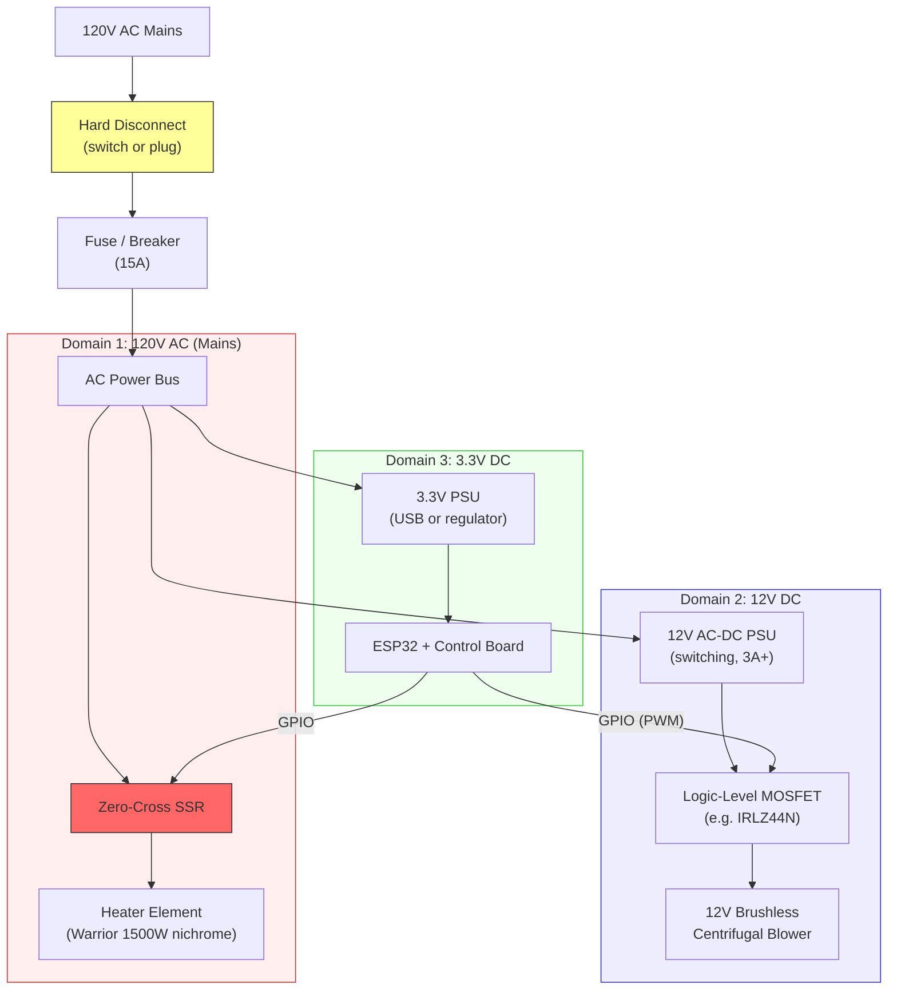
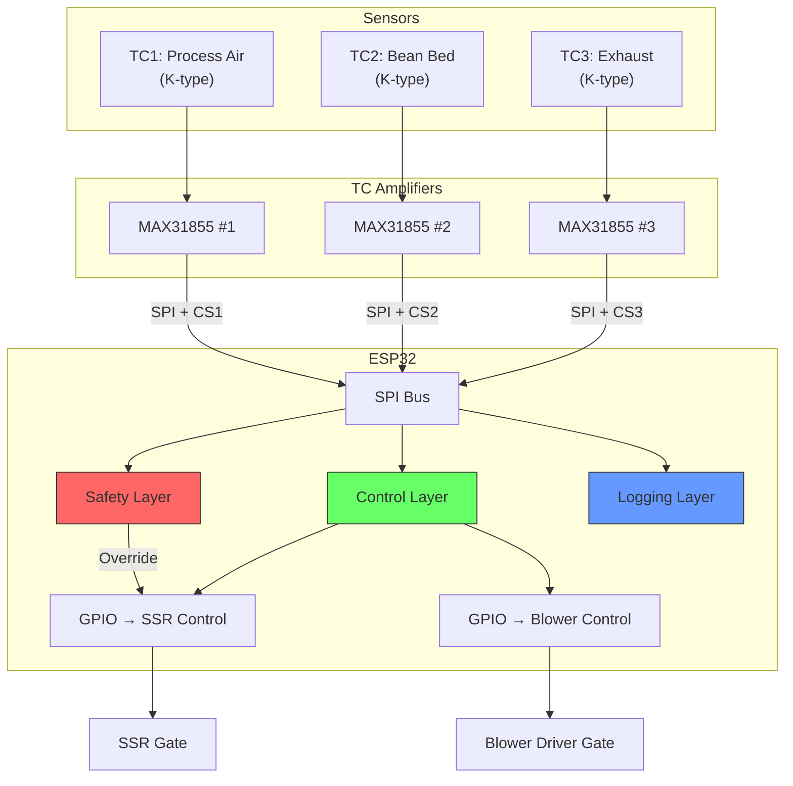
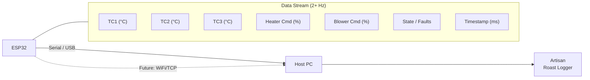

# System Block Diagram

## Overview

This document defines the system-level architecture for the v1 fluid-bed coffee roaster.
All subsystem boundaries and interfaces are defined here. Downstream design work
(mechanical, electrical, firmware) must be consistent with these diagrams.

---

## Air Path

The process airflow is the core physical system. Everything else exists to support,
control, and measure this flow.

### Air Path Notes

| Segment | Key Parameter | Design Concern |
|---------|--------------|----------------|
| Blower → Heater Can | Airflow rate (CFM), static pressure | Hose clamp joint (not welded) to preserve future bypass option (DR-005) |
| Heater Can | Air temperature rise | Element must fit the can; air must contact element long enough for heat transfer |
| Heater Can → Plenum | Side-entry velocity | High inlet velocity must be tamed by plenum + baffles |
| Plenum + Baffles | Pressure equalization | Convert directional jet to uniform pressure field |
| Distributor Plate | Velocity uniformity | Critical tuning component — must be swappable for iteration |
| Roast Chamber | Fluidization quality | Even bed motion, no dead zones, no geysering |
| Expansion Chamber | Chaff separation by velocity drop | Step-up from chamber dia to ~4" OD drops velocity to 2-4 ft/sec; chaff settles (DR-006) |
| Mesh Screen | Secondary chaff capture | 30×30 SS mesh; removable for cleaning between roasts |
| Exhaust | Backpressure budget | Expansion chamber + mesh must not restrict flow enough to impede fluidization |

### Cooling Mode (DR-005)

During cooling: SSR off (heater 0%), blower 100%. Air path remains serial
(Blower → Heater Can → Plenum → Chamber). Residual heater thermal mass
(~13-23 kJ) dissipates in ~15-30 seconds at 10-15 CFM forced convection.
Target: beans from ~200°C to <50°C within 140 seconds.

The blower-to-heater-can joint is a hose clamp connection, not welded. If
TP-002 data shows thermal lag is unacceptable, the heater can can be physically
disconnected for bypass cooling, or a diverter added later.

---

## Power Path

### Power Path Notes

- **Three power domains:** 120V AC (heater), 12V DC (blower), 3.3V DC (controls)
- Hard disconnect is **mandatory** — must be reachable during operation
- Fuse sized for total load: heater + 12V PSU + 3.3V PSU (~13A max at 120V)
- SSR is controlled by ESP32 via zero-cross switching for burst-fire duty control
- Blower driven by MOSFET with PWM from ESP32 — no AC motor control needed
- 12V PSU: switching wall wart or enclosed supply, 3A minimum
- Both low-voltage PSUs must be isolated from mains; ESP32 side is entirely low-voltage
- Flyback diode required across blower motor leads
- **All metal chassis components must be grounded to mains earth**

---

## Signal Path

### Signal Path Notes

- Three MAX31855 breakout boards share a single SPI bus with individual chip-select lines
- SSR control is a single GPIO (logic-level, active high assumed until schematic finalized)
- Blower control GPIO drives a logic-level MOSFET gate via PWM
- **Safety layer has hardware-priority override on SSR GPIO** — it can force heater off regardless of control layer state
- All signal wiring must be physically separated from mains wiring

---

## Data Path

### Data Path Notes

- v1 primary interface: **USB serial** at 115200 baud (or as Artisan requires)
- Protocol: Modbus TCP or Artisan serial protocol (to be specified in `docs/software/artisan-integration.md`)
- Minimum sample rate: **2 Hz** per channel (Artisan expects 1-3 second intervals)
- Future option: ESP32 WiFi for wireless logging (same data format, TCP transport)
- All data fields are logged even in manual mode — this is the characterization dataset

---

## Subsystem Boundary Summary

| Subsystem | Inputs | Outputs | Interface Owner |
|-----------|--------|---------|-----------------|
| Blower | 12V DC via MOSFET, PWM speed command | Airflow + pressure | Electrical → Mechanical |
| Heater Can | Airflow, AC power via SSR | Heated airflow | Electrical → Mechanical |
| Plenum + Plate | Heated airflow (side entry) | Uniform upward velocity | Mechanical |
| Roast Chamber | Uniform hot air, green beans | Roasted beans, hot exhaust + chaff | Mechanical |
| Expansion Chamber | Hot air + chaff | Separated chaff, slower air | Mechanical |
| Mesh Screen + Exhaust | Slow air with residual chaff | Clean exhaust out | Mechanical |
| TC Sensors (x3) | Physical temperature | SPI digital readings | Electrical → Firmware |
| ESP32 Control | Sensor data, operator commands | SSR duty, blower command, data stream | Firmware |
| Safety System | Sensor data, fault signals | Override commands, fault latch | Firmware (authoritative) |
| Artisan Interface | Serial data stream | Roast logs, visualization | Firmware → Host PC |

---

## Cross-Reference

- Mechanical details: `docs/mechanical/`
- Electrical schematic: `docs/electrical/`
- Firmware architecture: `docs/software/firmware-architecture.md`
- Safety logic: `docs/software/safety-logic.md`
- Artisan protocol: `docs/software/artisan-integration.md`
